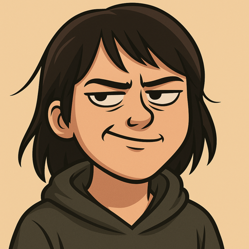

<!-- SEO Meta Tags -->

<meta name="description" content="Kristina P. Sinaga - AI Researcher and Applied Mathematics Ph.D. specializing in scalable AI models, federated learning, and Edge AI solutions.">
<meta name="keywords" content="AI Research, Applied Mathematics, Federated Learning, Edge AI, Machine Learning, Privacy-Preserving AI, Clustering, Multi-view Learning">
<meta name="author" content="Kristina P. Sinaga">
<meta property="og:title" content="Kristina P. Sinaga | AI Researcher & Applied Mathematics Ph.D.">
<meta property="og:description" content="Innovative AI researcher specializing in scalable, interpretable, and trustworthy AI models for real-world applications.">
<meta property="og:image" content="assets/images/DSC03661.JPG">
<meta property="og:url" content="https://kristinap09.github.io/clown-network/">
<meta name="twitter:card" content="summary_large_image">

<meta name="viewport" content="width=device-width, initial-scale=1.0">
<link rel="stylesheet" href="https://fonts.googleapis.com/css2?family=Inter:wght@300;400;600;700&display=swap">
<link rel="stylesheet" href="https://cdnjs.cloudflare.com/ajax/libs/font-awesome/6.0.0/css/all.min.css">

<!-- Globe Visualization Dependencies -->

  <header class="header">
    <h1>Kristina P. Sinaga</h1>
    
"It's not about being seen working—it's about delivering something worth seeing."

    
Where Value-Driven Work Meets Innovation

  </header>

  <!-- Guest Editor Announcement -->
<section class="guest-editor-announcement">
    

        <i class="fas fa-bullhorn announcement-icon"></i>
        <h2>🎯 Special Announcement: Call for Papers</h2>
    

    

        <h3>Guest Editor - MDPI Future Internet Special Issue</h3>
        
I am honored to serve as <strong>Guest Editor</strong> for the prestigious <strong>MDPI Future Internet</strong> journal's special issue on <strong>"Clustered Federated Learning for Networks"</strong>.

        
        

            <h4>📢 We Invite Your Contributions!</h4>
            
Submit your groundbreaking research in:

            

                
🔗 Clustered Federated Learning Algorithms

                
🌐 Network-Aware Federation Strategies

                
🔒 Privacy-Preserving Clustering Methods

                
⚡ Distributed ML Optimization

                
📱 Edge Computing & IoT Applications

                
🔐 Blockchain-Enhanced Federated Learning

            

        

        
        

            

                <h5>📚 Journal Details</h5>
                
<strong>MDPI Future Internet</strong> (Impact Factor: 3.4) 
                Open Access • Fast Review • Global Reach

            

            

                <h5>📅 Important Dates</h5>
                
<strong>Submission Deadline:</strong> August 20, 2026 
                <strong>Review Process:</strong> Fast-track available

            

        

        
        

            <a href="https://www.mdpi.com/journal/futureinternet/special_issues/1UP93P6G94" class="btn-primary" target="_blank">
                <i class="fas fa-paper-plane"></i> Submit Your Paper
            </a>
            <a href="mailto:kristinapestaria.sinaga@isti.cnr.it" class="btn-secondary">
                <i class="fas fa-envelope"></i> Contact Guest Editor
            </a>
        

        
        

            
<strong>Why Publish With Us?</strong>

            

                ✅ High-Impact Journal
                ✅ Expert Review Process
                ✅ International Visibility
                ✅ Open Access Publication
            

        

    

</section>

  

<section class="featured-post">
    <h3>Modern Work Philosophy</h3>
    
<strong>Creating Impact Through Purposeful Innovation</strong>

    <a class="btn" href="./clown-network/chronicles/homepage_with_links_resume.html">
      Explore My Approach
    </a>
  </section>

<section id="philosophy" class="profile-section">
    <h2>Work Philosophy</h2>
    

      
In today's evolving world of work, I believe performance is defined by clarity of thought, autonomy in execution, and the ability to create lasting value.

      

        

          

            <i class="fas fa-bullseye"></i>
          

          <h3>Outcome-Focused</h3>
          
Success measured by tangible impact and real-world applications, not just theoretical achievements.

        

        

          

            <i class="fas fa-brain"></i>
          

          <h3>Deep Focus</h3>
          
Quality work through uninterrupted concentration and deliberate problem-solving approaches.

        

        

          

            <i class="fas fa-sitemap"></i>
          

          <h3>Systems Approach</h3>
          
Building scalable frameworks that create lasting value in AI and mathematical applications.

        

        

          

            <i class="fas fa-lightbulb"></i>
          

          <h3>Continuous Innovation</h3>
          
Staying at the forefront of AI research through constant learning and adaptation.

        

      

    

  </section>

<section id="about" class="profile-section">
    <h2>About Me</h2>
    
    

     
 I’m a strategic thinker, problem-solver, and someone who doesn’t entertain clown logic. I hold a Ph.D. in Applied Mathematics from Chung Yuan Christian University (CYCU), Taiwan — but I don’t wear that title like a costume. I use it.

My passion? Building AI solutions that don’t just float in theory — they land, perform, and endure. I specialize in designing scalable, interpretable, and trustworthy models that work in decentralized, real-world environments — especially where resources are limited but expectations are high.

I work across clustering, multi-view learning, federated learning, and Edge AI — bridging theory and application like it’s second nature.

My approach is simple:
No noise. No fluff. Just precision that performs.

    

  </section>

<section id="research" class="profile-section">
    <h2>Research Focus</h2>
    

      

        

          <i class="fas fa-network-wired"></i>
        

        <h3 class="research-title">Federated Learning & Edge AI</h3>
        
Developing privacy-preserving distributed learning systems for edge devices.

        

          Federated Learning
          Edge Computing
          Privacy
        

      

      

        

          <i class="fas fa-project-diagram"></i>
        

        <h3 class="research-title">Multi-view (MV) Learning</h3>
        
Innovative approaches to combining multiple data perspectives for enhanced model performance.

        

          Clustering
          Data Fusion
          ML Models
        

      

      

        

          <i class="fas fa-shield-alt"></i>
        

        <h3 class="research-title">Privacy-Preserving AI</h3>
        
Building secure and trustworthy AI systems that protect user privacy.

        

          Security
          Encryption
          Trust
        

      

      

        

          <i class="fas fa-chart-line"></i>
        

        <h3 class="research-title">Industrial AI</h3>
        
Anomaly detection and monitoring systems for industrial applications.

        

          Monitoring
          Analytics
          IoT
        

      

    

  </section>

<section id="global-reach" class="profile-section">
    <h2>Global Reach</h2>
    

        

        

            <h4>Visitors Today</h4>
            
Loading...

        

    

  </section>

<section id="contact">
    <h2>Contact</h2>
    

      
<i class="fas fa-envelope"></i> Email: <a href="mailto:kristinapestaria.sinaga@isti.cnr.it">kristinapestaria.sinaga@isti.cnr.it</a>

      
<i class="fas fa-envelope"></i> Email: <a href="mailto:neuralglowai@gmail.com">neuralglowai@gmail.com</a>

      

        <i class="fas fa-exclamation-triangle"></i> 
        Note: The email address <strong>kristinasinaga41@gmail.com</strong> is no longer under my authority. Please do not use it to contact me.
      

    

    

      <a href="https://www.linkedin.com/in/kristina-p-sinaga-0ba152309?" title="LinkedIn"><i class="fab fa-linkedin"></i></a>
      <a href="https://github.com/KristinaP09" title="GitHub"><i class="fab fa-github"></i></a>
      <a href="https://x.com/Kristina57040" title="Twitter"><i class="fab fa-twitter"></i></a>
      <a href="https://scholar.google.com/citations?user=yNWQLYAAAAAJ&hl=it&oi=ao" title="Google Scholar"><i class="fas fa-graduation-cap"></i></a>
    

</section>

<!-- Schema.org markup for Google -->

